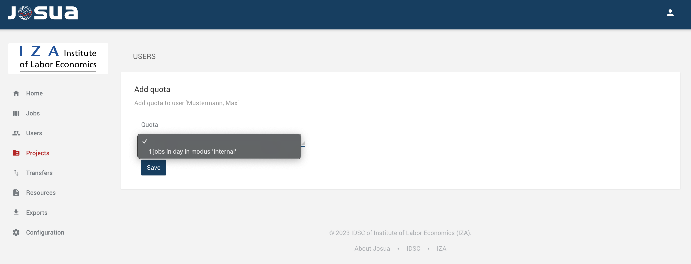
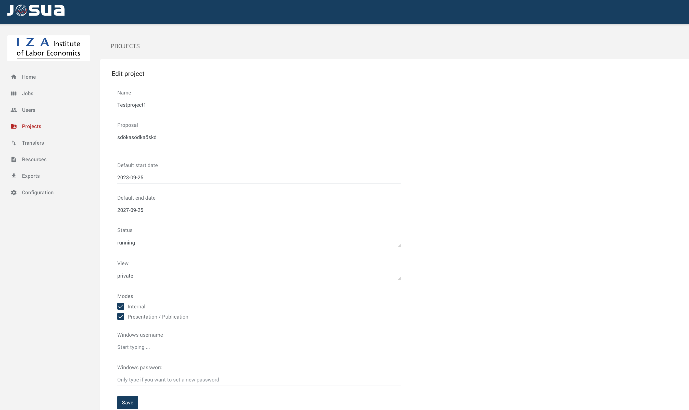
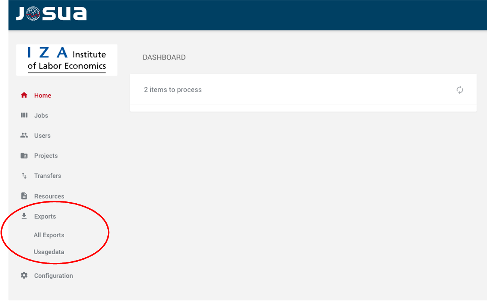
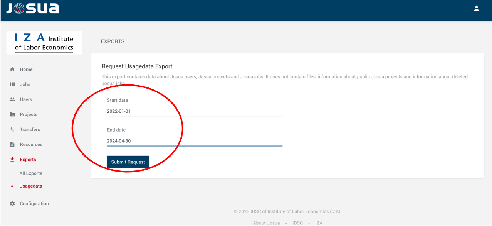

# Documentation on using  the Job Submission Application - Operator Interface  (Josua). 
### From the Research Data Center of IZA (IDSC)

Version: January 2025

## Table of Contents

[Acknowledgment](#acknowledgment)  
[List of Figures](#list-of-figures)  
[List of Abbreviations](#list-of-abbreviations)  
[Login Josua-Web](#login-josua-web)  
[Josua-Web: Dashboard](#josua-web-dashboard)  
[Josua-Web: Dashboard-Home](#josua-web-dashboard-home)  
[Josua-Web: Jobs](#josua-web-jobs)  
[Internal Mode (IM) Functionality in Josua](#internal-mode-im-functionality-in-josua)  
[Add Quota](#add-quota)  
[File Transfers](#file-transfers)  
[Resources](#resources)  
[Configuration Section](#configuration-section)  
[Configuration Conversion](#configuration-conversion)  
[Configuration Filters](#configuration-filters)  
[Configuration Modes](#configuration-modes)  
[Configuration Nodes](#configuration-nodes)  
[Configuration Notifications](#configuration-notifications)  
[Configuration Quotas](#configuration-quotas)  
[Configuration Users](#configuration-users)  
[Configuration Other: Message](#configiration-other-message)  
[Configuration Other: Login](#configuration-other-login)  
[Configuration Other: Projects](#configuration-other-projects)  
[Configuration Other: Active Directory](#configuration-other-active-directory)  
[Configuration Other: Output Processing](#configuration-other-output-processing)  
[User Statistics](#user-statistics)  

## List of Figures
Fig. 1: Josua-Web login  
Fig. 2: Josua-Web Dashboard-Home  
Fig. 3: Details of the selected job   
Fig. 4: Details of the all users  
Fig. 5: Add Quota  
Fig. 6: Details of the user  
Fig. 7: Project overview  
Fig. 8: Project details  
Fig. 9: Project settings  
Fig. 10: Add member  
Fig. 11: Add quota  
Fig. 12: Filetransfers open requests  
Fig. 13: Filetransfers view  
Fig. 14: File transfers history   
Fig. 15: Configuration overview  
Fig. 16: Conversion overview  
Fig. 17: Filters overview  
Fig. 18: Modes overview  
Fig. 19: Edit modes  
Fig. 20: Nodes  
Fig. 21: Edit nodes  
Fig. 22: Notifications  
Fig. 23: Packages  
Fig. 24: Quotas  
Fig. 25: Export menue  
Fig. 26: Export time period selection  
Fig. 27: Exports overview 

## List of Abbreviations
 * IM - Internal Mode  
 * Josua - Job Submission Application  
 * PM - Presentation/Publication Mode  

## Acknowledgment

We would like to express our gratitude to the Research Data Center of the German Federal Employment Agency (BA) at the Institute for Employment Research (IAB) and the Research Data Centre at the Federal Institute for Vocational Education and Training (BIBB) for providing the Josua documentation materials that we were allowed to use for this documentation. It greatly assisted us in shaping the content. Additionally, we extend our thanks for their support in creating this manual to our colleagues Nikos Askitas, David Schöpf, and Dominik Wasielewski.

## Login Josua-Web

 Typically, access to Josua-Web is provided via the Internet. Upon navigating to the designated website, the Josua-Web start page is displayed, featuring a login interface. Users can enter their credentials, provided by the Josua Operator, to gain access.

  
Fig. 1: Josua-Web login  

## Josua-Web Dashboard  

After a successful login, the Josua dashboard for operators is displayed, providing access to User, Job, Project, and System Administration functionalities. The main menu is located in the top left corner and includes several tabs: Home, Jobs, Users, Projects, Transfers, Resources, Exports, and Configuration. Each tab will be explained in detail below, with Home set as the default selection upon login.

In the upper right corner, a small torso icon allows operators to log out of the system.

## Josua-Web: Dashboard-Home  

The Home tab, shown in Figure 2, provides an overview of the most recent Josua jobs, displaying their current status and indicating whether they were executed successfully.

In the center, under Latest Jobs, a list of the most recently initiated jobs across all projects is displayed. On the upper right, under System State, system statistics are presented, offering insights into server utilization and usage intensity across all Josua users and jobs.

  
Fig. 2: Josua-Web Dashboard-Home   

## Josua-Web: Jobs

The Jobs section provides an overview of all jobs, categorized by their status. The available statuses include:

* NEW: Displays the most recently submitted jobs.
* RUNNING: Lists currently active jobs.
* CENSOR: Shows jobs under review for compliance with the data protection regulations of the respective Josua provider.
* LATEST: Takes users directly to the jobs most recently processed by Josua.

### Sorting Options

Using the three horizontal bars on the right, job lists can be sorted according to the following criteria:

* Date: Sorts jobs in descending order based on the date they were processed. 
* Mode: Sorts jobs by submission mode (Internal or Publication/Presentation).
* Node: Groups jobs by the compute node used for processing.
* Package: Sorts jobs by the software package used (e.g., SPSS, Stata, R, Python).
* Projects: Organizes jobs by their assigned project names.

### Job Overview Box

For each job, the overview box provides the following details:

* Project Name: The project associated with the job.
* User: The person who submitted the job.
* Timestamp: The exact date and time of job submission.

**Additional information includes:** 

* Job Number: A unique sequential identifier for the job.
* Mode: Indicates Internal Mode (IM) or Publication/Presentation Mode (PM).
* Software Package: The software used for processing (e.g., SPSS, Stata, R, Python).
* Compute Server: Identifies the node (e.g., Node23) that processed the job(s). 
* Current Status: The status of the job within the workflow, which may include:

  - running: The job is being executed.
  - censoring: The job is undergoing review (PM) or generating PNG files (IM).
  - released: The job has been successfully completed (PM/IM).

* Status Message: Displays the job’s current state, such as QUEUE, RUNNING, OK, or FAILED.

**Supplementary Status Details** 

In the final field of the list, additional status details may appear:
   - „success“: The job was completed successfully.
   - „failed“: The job was interrupted. In certain cases, a failed status may appear despite successful completion (e.g., due to a technical issue with R).
   - „aborted“: The job was manually stopped by the user before completion. 

### Detailed Job Information 

To view supplementary job details, click the three vertical dots on the right in the overview box. This reveals additional sections:

* Input/Output: Displays all submitted input files and corresponding output files.

* Runs: Provides details of all runs for the job, including:

  - Planned: When the job was scheduled.
  - Started: When execution began.
  - Finished: When the job completed. 
  - Last Active: Reports the node’s last activity for the job. If there is an excessive time gap between job submission and processing, this may indicate a need to adjust the node configuration.

Each run includes the final status (e.g., finished) and specifies the processing node (e.g., Node23).

A summary list of all runs for this job and user comments on jobs within the project is also available, providing a comprehensive overview.

Fig. 3 Details of the selected job

## Internal Mode (IM) Functionality in Josua

The Internal Mode (IM) is designed for tasks such as data editing, preparation for on-site visits, and testing program code. IM serves two primary purposes: 

* Preliminary analysis check: It allows users to verify the accuracy of their analysis results before further processing.
* Error-free code execution: It ensures that the submitted code runs without errors within the Josua environment.

The Internal Mode (IM) provides users with significant flexibility, allowing them to submit an unlimited number of jobs within any given timeframe for testing and refinement of their programs. However, it is within the discretion of the Josua provider to impose restrictions if needed.

For instance:
* Jobs in IM may be configured to process sequentially rather than in parallel to optimize system resources or ensure fair usage.
* Other limitations, such as setting maximum job submission rates or implementing specific rules, can also be defined by the Josua provider as necessary.

These measures ensure that the system operates efficiently while maintaining the flexibility that IM offers for program development and testing.

In IM, uploaded code is executed automatically, and results are displayed with a watermark. These outputs are intended solely for internal use, supporting the development and refinement of programs.

To ensure compliance with data protection regulations, the Josua provider has the option to implement restrictions and anonymization measures for visible results. These may include:

* Limiting cell counts in output tables (e.g., ensuring no cells contain values <=3).
* Suppressing or restricting specific commands that may compromise data confidentiality.

All such measures can be tailored by the Josua provider to meet specific regulatory requirements or operational needs. Additionally, providers may impose further limitations on IM usage, such as sequential processing of jobs, to optimize resources and maintain system efficiency.

### Access and Availability of IM Results

Please note the following considerations for accessing and retaining results in Internal Mode (IM):
* Temporary Accessibility: Results from IM jobs are accessible only until a new job is uploaded in Publication Mode (PM). Once a PM job is submitted, the results from IM are no longer available.
* Conditional Availability: The availability of IM results is influenced by several factors, including:
  - Server Load: High demand on the system may delay result availability.
  - Computational Strain: The complexity and resource requirements of other tasks may impact processing times.
  - Reviewing Efforts: The effort and time required by the Josua provider to review and process results.

These factors ensure efficient system performance while maintaining compliance with operational and data protection requirements. For optimal use, users should download or review IM results promptly before uploading PM jobs.

The preliminary results generated in Internal Mode (IM) are intended solely for internal use and must not be viewed, copied, or utilized by third parties. To safeguard data privacy in IM, the Josua provider may block certain commands to prevent potential misuse.

For a detailed list of restricted commands, refer to the section [Special Features of Selected Commands](#SpecialFeatures)).

## Josua-Web User Management Tool

The User Management section provides a comprehensive overview of all users in the system. When this section is selected, a table displays key information about each user, including:

* a user ID (to identify the user), and the following details on all users:
* the Surname (user's surname), 
* the First name (user's first name), 
* the Username (user's username). 
* the Email (user's Email-address), 
* the Number of jobs assigned (per user), 
* the Number of projects (per user), 
* Date the user account was created.

Fig. 4: Details of the all users

Clicking the blue ‘View’ button in the user table provides direct access to a detailed overview of a specific user’s profile. This interface offers a comprehensive summary of the user’s information, along with navigation options for managing various aspects of their account.

### Navigation Tabs Overview

The following tabs are available in the detailed user view:

* Details: Displays the user’s basic information, including their name, email, username, account status, and the date the account was created.
* Projects (2): Indicates the user is involved in 2 projects, with all associated projects listed in this tab.
* Jobs (35): Shows that the user has 35 jobs assigned. All jobs are fully displayed in this section, including their statuses and details.
* Quotas (0): Indicates there are no quotas associated with this user.

This organized layout ensures easy navigation and access to relevant user-specific data, enabling efficient management within the Josua system.

Quotas can be configured to regulate the number of jobs submitted per user and per project. These quotas define the maximum number of jobs that Josua can process for each user or project within a specified time frame (e.g., per day, per 10 days, per month, etc.).

Key features of the quota system include:
* Flexible Configuration: Quotas can be tailored to suit operational needs and ensure efficient resource usage.
* Administrator Control: Only Josua administrators can enforce quotas that cannot be modified or removed by users or operators, ensuring compliance with system policies (see details in the Quota Settings section of the Configuration menu).
* Custom Integration: Quotas can be developed using modern programming languages such as Python and integrated into the system by the Josua provider.

Fig. 5: Add Quota

To modify user information or assign specific user quotas, click the three vertical dots on the right side of the overview box. This action opens options for:

* Editing the selected user’s details.
* Adding or modifying user-specific quotas.

In the main section of the screen, under the “Change User” menu, several fields are available for updating user information:
* Surname: Modify the user’s last name.
* Firstname: Modify the user’s first name.
* Email: Update the user’s email address.
* Username: Change the username used for the login mask.
* Password: Update the password associated with the login mask.
* Remarks: Add or edit remarks about the user’s characteristics or roles.
* Status: Enable or disable the user’s access to the Josua system.

### Assigning Quotas

User-specific quotas can also be added or adjusted within this section. These quotas define limitations on the number of jobs the user can submit within a specified time frame. For more details on quota settings, refer to the Quota Management section of the documentation.

At the bottom of the form, there is a “Save” button to save any changes made to the user’s details.

Fig. 6: Details of the user

## Josua-Web Project Management Tool

The Project Management section provides a comprehensive overview of all projects. Upon selecting this section, the main content area displays a table listing all projects with the following headers: ID, Name, Start Date, End Date, Active Members, Jobs, and Created.

The table includes detailed information for each project:
* ID: A sequential project number for identifying the project.
* Name: The project’s name and a brief description.
* Start Date: The date when the project began.
* End Date: The projected end date of the project.
* Active Members: The total number of members allowed to participate in the project, as well as the number of members active during the current project period.
* Jobs: The total number of jobs submitted by all project members.
* Created: The date and time when the project was created in the system.

This structured view allows operators and users to easily manage and track project details and statuses. The following image illustrates a screenshot from the Projects section in the Josua platform, showcasing the project management interface with the Overview tab selected as the default view. 

Fig. 7: Project overview

To create a new project, click on the three vertical dots located on the right side of the overview box and select “Create New Project.” A form will appear, allowing you to enter and save project details based on the predefined template described above.

To access detailed information about a specific project, click the blue button under ‘View.’ This will take you directly to the project’s detailed page.

Fig. 8: Project details

Overview reveals the following key aspects and details on:

* Project Name: Displays the name of the project.
* Proposal: Shows the project abstract or summary.
* Default runtime: Indicates the defined timeline for the project, from start to end.
* Status: Displays the current status of the project as one of the following:

  - “Running”: The project is actively in progress.
  - “Closed”: The project has ended.
  - “Preparing”: The project is in preparation.

* Access: Specifies whether the project is:
  - “Private”: Restricted to specific users.
  - “Public_Readonly”: Accessible to all Josua users in a write-protected format, often used for teaching purposes.

* Submission mode: Lists options such as “Internal” or “Presentation/Publication”, highlighting flexibility in how project outputs can be submitted or shared, with the possibility of selecting multiple options simultaneously.

To access additional project information, click on the three vertical dots located on the right-hand side of the overview box. From the menu that appears, you can perform additional actions, including:
* Settings: Configure or modify project-specific settings.
* Add Member: Invite or assign new members to the project.
* Add Quota: Allocate or adjust resource quotas for the project.

In the ‘Settings’ section, you can input or update information for the following project elements:

* Project Name: (the name of the project)
* Proposal: (project abstract)
* Default runtime: (defined timeline from start to end)
* Status: (indicator that projects are actively being "running", "closed" (ended), or "preparing" (in preparation))
* Access: (project marked as "private", or "public_readonly" meaning it is either restricted or accessible to all Josua users-for write protected teaching purposes).
* Submission mode: includes options such as "Internal", "Presentation/Publication", which indicates flexibility in how project outputs can be submitted or shared and selected simultaneously. 

Fig. 9: Project settings

Additionally, it is possible to change or enter a new Windows username and Windows password for identity and access management in the Windows-Backend. 

In "Add Member",’ you can input or edit information for the following aspects. 

Individual users can be added to the project from a drop-down menu. Additionally, the project duration can be set for the selected user. This process can be repeated for each user, allowing for different usage periods to be assigned per project, depending on whether they are needed for specific project objectives such as revisions or additional calculations after the project’s conclusion.

Fig. 10: Add member

In existing projects, the ‘Edit Member’ option allows you to specify whether incoming analysis jobs or outgoing results for individual project members are automatically processed or submitted for review by the Josua operator. In this case, incoming analysis jobs and outgoing result files will only be made available to researchers after approval by the Josua operator.  

Incoming analysis jobs can be selected for review or automatic processing by enabling the ‘Autocensor (inbound)’ option. The ‘Autocensor (outbound)’ option enables the same for outgoing analysis results.

Additionally, specific users can be designated as Principal Investigators. In projects with multiple participants, this facilitates the assignment of responsible points of contact. The ‘Save’ button allows changes to be saved permanently.

## Add Quota   

Quotas can be defined and set per job or per project. Quotas that were previously created and are available in the Quotas menu can be assigned to the project here. An unlimited number of quotas can be added.

Fig. 11: Add Quota

## File Transfers

The picture displays the File Transfers section of the Josua platform, where operators can view and manage file transfer requests from users. The interface is divided into two main tabs: Open Requests and History, with the current view displaying Open Requests.  

Fig. 12: Filetransfers Open Requests

The following key elements are available in Open Requests as ongoing open requests.

*	ID: A unique identifier for each file transfer request.
* Project: Indicates the project to which the file transfer belongs.
* User: Displays the name of the user requesting the transfer (e.g., 
   Mustermann, Max”).
* Filename: Shows the name of the file being transferred (e.g., “sumstat.do”).
* Created At: Displays the timestamp of when the request was created (e.g., “2023-11-15 13:28:48”).
* A View button is provided next to each file transfer request for reviewing or processing the request.

After pressing the view button a preview is provided for the file that needs to be transferred. Here is a breakdown for the three vertical dots from the Action Menu and its key elemenst on the right side:

* Download original: Option to download the original version of the file.
* Download censored: Option to download the censored version of the file.
* Censor: Option to manually censor the file.
* Censor external: Option to apply external censorship in external editor.
* Accept: Option to accept the file transfer request.
* Drop: Option to reject the file transfer request.
* Reset: Option to reset any censorship actions taken.
* Reload uncensored: Option to reload the uncensored version of the file.

Fig. 13: Filetransfers View

### File Transfers History

The History tab in Josua provides an organized view of completed file transfer requests, allowing operators to review and manage transfer details efficiently. This section is presented in a tabular format, with the following columns and their functionalities:

* ID: A unique identifier assigned to each file transfer request, ensuring traceability and easy referencing.
* Project: Displays the project name linked to the file transfer request.Example: The project in this example is “Testproject1.”
* User: Indicates the name of the user who initiated the file transfer. Example: The listed user is “Mustermann, Max.”
* Filename: Shows the name of the file that was transferred, enabling operators to identify the content. Examples: Files such as “sumstat.do” and “summary.pdf” are shown in the table.
* Created At: The timestamp indicating when the file transfer request was created. Example: The transfer request for “sumstat.do” was created on 2023-11-15 at 13:28:48.

Fig. 14: File Transfers History

After selecting the “View” button, a preview of the file scheduled for transfer is displayed. Additionally, the Action Menu, represented by three vertical dots on the right-hand side, offers the following key functions:

* Download original: Download the original, unaltered version of the file.
* Download censored: Download the censored version of the file.
* Censor: Download the censored version of the file.
* Censor external: Manually apply censorship to the file (in external editor).
* Accept: Approve and accept the file transfer request (after successfull censorship).
* Drop: Reject the file transfer request.
* Reset: Revert any censorship actions applied to the file.
* Reload uncensored: Reload the uncensored version of the file.

## Resources

The Resources tab enables operators to efficiently view and manage resources related to a specific project. The interface is structured into two primary sections: Open Resources and History. The default view displays the Open Resources tab, which lists all files that have been uploaded or are currently available for the project. This organized layout ensures that operators can easily access and manage project files in a streamlined manner.

The Open Resources tab displays ongoing open requests and provides the following key elements for managing these requests:

* Filename: Displays the name of the uploaded file. For example, “Related Occupations.xlsx” is listed.
* Submitted by: Indicates the user who submitted the file. In this example, the file was submitted by Max Mustermann.
* Timestamp: Shows the precise date and time of submission, such as 2023-11-13 09:29:54.
* Status: Reflects the current processing stage of the file, such as “NEW” for files that have just been added or are yet to be processed.

By clicking the three vertical dots next to the file, a dropdown menu appears, showing the following actions:

* Download original: Allows the user to download the original, unaltered version of the file.
* Download censored: Provides the option to download a censored version of the file, if applicable.
* Censor: Enables manual censorship of the file directly within the system.
* Accept: Confirms and approves the file transfer request.
* Drop: Rejects the file transfer request and removes it from the queue.

### Resources History

The Resources History tab offers operators a comprehensive overview of previously submitted resources, providing essential details such as filenames, submission timestamps, and their current processing status. This tab is designed for easy navigation and efficient resource management. 

Each resource entry in the Resources History tab provides the following key details for efficient tracking and management:

* Filename: Displays the name of the uploaded file. In the example provided, the files include:
	-	lpersonal.mlib.rtf
	-	multparse.ado
	-	Related Occupations.xlsx
* Submitted by: Indicates the user who uploaded the file. In this case, all files were submitted by Max Mustermann, linked to the project Testproject1.
* Timestamp: Shows the exact date and time when the file was uploaded, ensuring a clear chronological record:
	-	lpersonal.mlib.rtf was submitted on 2023-11-14 at 11:23:21.
	-	multparse.ado was submitted on 2023-11-13 at 09:35:39.
	-	Related Occupations.xlsx was submitted on 2023-11-13 at 09:29:54.
* Status: Reflects the current state of each file, providing a clear understanding of its progress or resolution:
	-	lpersonal.mlib.rtf: Marked as DROPPED, indicating it has been discarded or rejected.
	-	multparse.ado: Marked as OK, indicating it has been successfully processed or approved.
	- 	Related Occupations.xlsx: Marked as NEW, indicating it is a recent submission and might still require action.

Next to each file entry, a menu button (represented by three vertical dots) provides access to additional file management actions. These options include:

* Download original: Enables users to download the original, unaltered version of the file.
* Download censored: Provides the option to download a censored version of the file (disabled in the current example).
* Censor: Offers a tool for manually censoring specific content within the file.
* Accept: Offers a tool for manually censoring specific content within the file.
* Drop: Rejects the file and removes it from the resource list.

## Configuration Section

On the left side of the screenshot, a navigation menu provides access to various sections of the Josua platform. The Configuration option is highlighted, indicating the currently active section. Each menu item corresponds to a distinct set of system settings, which are detailed in the subsequent sections.

The Configuration menu includes the following sub-options:
* Conversion: Configure graphic overlays for output files.
* Filters: Manage and configure rules for input and output filtering.
* Modes: Edit and customize various submission modes.
* Nodes: Adjust settings for essential compute nodes.
* Notifications: Set notification preferences for different user roles.
* Packages: Manage software packages available for data processing.
* Quotas: Define and control usage limits for system resources.
* Users: Manage user access levels and permissions.

Fig. 15: Configuration overview

## Configuration: Conversion

This section of the Josua platform enables users to customize graphic overlay settings for data output, ensuring clear and consistent visual presentation and protection.

* Center Text:Specifies the disclaimer message displayed prominently on the output. In the example, the message reads:
“All results of this output are confidential. It is not allowed to publish any of the results or make this output available outside the user group(s) of the contract.”

* Font Size: Sets the size of the overlay text. For this configuration, the font size is 35.

* Blend: Adjusts the transparency level of the overlay text. A blend value of 65 is applied, where higher values result in greater transparency.

* Save Button: Enables users to apply and preserve any modifications to the overlay settings by selecting the Save button.

Fig. 16: Conversion overview

Clicking the three vertical dots in the Converters box opens a menu that enables operators to adjust the configuration of a specific converter within the Josua platform. This section provides an overview of the key configuration options for a specific converter, as illustrated below:

* Converter name: Specifies the name of the configured converter. In this example, the converter is labeled as “josua3-test-intern-converter”, uniquely identifying it within the system.
* Capacity: Indicates the maximum number of parallel conversions the converter server can process. Here, the value is set to 3, allowing the server to handle up to three concurrent tasks.
* Status: Reflects the operational state of the converter. In this instance, it is marked as Enabled, signifying that the converter is active and ready for use. Other available states include Disabled and Debug (though Debug functionality is not yet implemented).
* Port: Specifies the port used for the converter. If no port is explicitly defined, the system will default to the standard port settings.
* Save button: Located at the bottom of the configuration panel, this button allows users to save and apply any changes made to the converter settings.

##  Configuration: Filters

This section enables users to manage and configure filters, assign filter hosts, and define associated rules within the Josua system. Filter rules can be created using widely used programming languages such as Python, Perl, C#, and others. These modules can then be seamlessly integrated into the system by administrators, ensuring flexibility and compatibility with diverse requirements.

Fig. 17: Filters overview

1.	Filters:
* The interface displays two filters, each accompanied by a brief description and the creation timestamp:
	-	test-filter-1 (Designed for filtering input jobs)
	-   test-filter-2 output (Used for filtering output result files)
2.	Filter Hosts:
*  A filter host named josua3-test-intern-converter is listed with the following attributes:
	-	IP address: 10.11.1.10
	-	Identifier: fc2d3cd3a01893a
	-	Status: Enabled
	-	Linked filter: test-filter-2 output
	-	Creation date: 2023-09-28 15:20:53
3.	Filter Rules: One active filter rule is displayed with the following details:
	-	Filter: test-filter-2 output (for filtering outputs)
	-	Mode: Internal
	-	Package: Stata17
	-	Auto and Non auto columns are present.
	-	An Edit button is available for modifying the filter rule.

When a server is added, a unique identifier is automatically generated and stored within the server’s configuration. This identifier is immutable and cannot be modified once assigned.	

## Configuration: Modes

The Modes section within the configuration area of the Josua system allows operators to manage and customize various submission modes, enabling precise control over data handling and access permissions.

This section allows users to edit the submission modes. 

Fig. 18: Modes overview

The system operates in two distinct modes, each represented with a label and a toggle switch to indicate whether the mode is active or inactive:

* Two modes are listed:
- 	Internal Mode (int): Labeled as “Internal”
- Presentation/Publication Mode (pub): Labeled as “Presentation / Publication” 

The toggle switches allow users to easily enable or disable each mode as needed.

Each mode features an Edit button, allowing further customization. The image below showcases the Edit Mode screen, which is used to configure submission modes in the Josua software. The example highlights the editing options for Internal Mode, which are also applicable to the Presentation / Publication Mode.

Fig. 19: Edit Modes

1.	Mode Information:
	*	Mode Name: “int” (short for “Internal Mode”)
	*	Label: “Internal” (description of the mode)
2.	Configuration Options:
	*	Input visible: Set to “Enabled,” indicating that input fields are visible.
	*	Status: Set to “Enabled,” signifying the mode is active.
	*	Packages: The following packages are selected and activated for the Internal Mode:
	-	Stata17
	-	R 4.3.1
3.	Save Button:
	*	A Save button is located at the bottom of the screen to apply changes made to the mode configuration.

If the “Input Visible” option is disabled, the job’s input will no longer be accessible to the user after execution. This ensures that, during a guest session, users cannot upload a file and immediately download it externally, enhancing data security.

## Configuration: Nodes

This screen offers users a comprehensive view of the node’s configuration and system resources. The example below displays details for a node titled NODE23, which operates on Microsoft Windows Server 2019 Datacenter. The node provides the following technical specifications:

*	IP Address: 10.11.2.23
*	Node Identifier: f5538e3ce323579
*	Memory: 16.0 GB
*	CPU Cores: 4
*	Node ID: 1
*	Last Update Timestamp: 2024-02-03 12:21:37
*	Software Installed: Stata17, R 4.3.1

Fig. 20: Nodes

This screen enables operators to adjust critical compute node settings, providing the tools needed to effectively control and monitor node behavior within the Josua environment.

**Editable Node Parameters:**

*	Capacity: Displays the current capacity of the node, which is set to 1 (1 node available).
*	Status: Indicates whether the node is enabled or disabled. Currently, the node is set to “Enabled”.
*	Host: Shows the IP address of the host, currently set to 10.11.2.23.
*	Prevent Host Update: Allows users to block updates to the host configuration. This option is currently set to “Disabled”.

At the bottom of the screen, a Save button is provided to apply any changes made to the node configuration.

Fig. 21: Edit Nodes

## Configuration: Notifications

The image displays the Notifications Configuration screen within the Josua system. This screen serves as a centralized interface for setting up email alerts, ensuring that relevant personnel are promptly informed about critical system events and status changes. Users can define notification preferences for three distinct roles: User, Operator, and Administrator. To enable notifications, an email address must be configured for each role within the Operator Interface (OI). Notifications are delivered via email, providing an efficient way to keep stakeholders updated.

Notify User
* When a job has been released
* When the state of a transfer changes.
* When the state of a resource changes.

Notify Operator
* When a new job is submitted.
* When a job is completed.
* When a new resource is created.
* When a new transfer is initiated.
* When a node is automatically disabled.
* Email address for operator notifications: (Add appropriate email address here, if missing).

Notify Administrator
* When a node is automatically disabled.
* When a converter is automatically disabled.
* When a filter host is automatically disabled.
* Email address for administrator notifications: (Add appropriate email address here, if missing).

Fig. 21: Notifications

At the bottom of the screen, a Save button is provided to apply any changes made to the notification settings.Configuration: Packages

This screenshot from the Josua configuration interface displays the Packages section, where users can manage the software packages used for data processing. Currently, two packages are listed: 

* Stata17 with the label “Stata17”
* R with the label “R 4.3.1”

Each package is equipped with a toggle switch, enabling users to activate or deactivate it within the environment. Additionally, an Edit button is available next to each package, allowing users to modify settings or details associated with the software. The system supports adding any number of packages, such as Python or other tools, depending on requirements and availability.

Fig. 23: Packages

## Configuration: Quotas

The “Add Quota” interface enables operators to define and manage resource quotas, providing administrators with the tools to set and regulate usage limits according to specific requirements or organizational policies. This functionality allows for limiting the number of jobs processed per day or month, depending on the selected publication mode (Internal or Presentation/Publication).

* Label:A text field where operators can define a name or provide a description for the quota. This label assists operators in identifying the purpose or specific allocation of the quota.

* Mode: A dropdown menu enabling operators to select the applicable quota mode. In the displayed example, “Internal” mode is chosen, typically representing quotas for internal use. The dropdown also includes an option for “Presentation/Publication” mode, allowing quotas to be configured for external or presentation purposes.

* Quota Type**: A field to specify the type of quota. The following limits are provided and available through the drop-down menu: Jobs per day, or the number of jobs for 3, 5, 7, or 10 days, as well as the number of jobs per month or for 3, 6, or 12 months.

**Defaults Section**

* For New Projects: When selected, this option designates the specified quota as the default setting for all newly created projects.

* For New Users: When selected, this option assigns the specified quota as the default for all newly onboarded users, ensuring a consistent and standardized allocation of resources.

**Protections Section**

* Cannot be added manually: When enabled, this option restricts users from manually increasing their quota, ensuring that resource allocation remains under administrative control.

* Cannot be removed manually: When enabled, this option prevents users from manually reducing their quota, helping to maintain system stability and avoid accidental resource deallocation.

* Save: The Save button applies and finalizes the configured quota settings.

Fig. 24: Quotas

## Configuration: Users

This page provides tools for managing user roles and permissions, enabling administrators to define and adjust access levels for existing users based on operational needs. It ensures precise control over permissions, contributing to the system’s security and efficiency.

The following user roles are available:
* Administrator: Full access to all features and configurations.

* Operator: Intermediate access with permissions to perform specific tasks.

* User: Limited access to basic functionalities.

The Users section under Configuration is not intended for creating new user accounts. Instead, it is used to manage the roles of existing users by:

* Promoting accounts to higher access levels (e.g., Operator).

* Demoting accounts to lower access levels (e.g., User).

This interface plays a critical role in maintaining the security and operational efficiency of the Josua platform by allowing precise adjustments to user permissions.

Save: Clicking the Save button applies and finalizes any changes made to the user settings.

### Configiration Other: Message

This feature enables operators to share important announcements or alerts directly with all users across the system. It ensures consistent and visible communication for various purposes, such as:

* Notifying users about scheduled maintenance windows.
* Highlighting system updates or critical deadlines.
* Broadcasting general reminders or warnings.

Through this configuration, administrators can ensure that key messages are delivered effectively across the platform.

The Status field allows operators to control the visibility of the message:

* Enabled: The message will be displayed prominently on every page.

* Disabled: The message will not be visible to users.

The Message field is used to compose the text that will appear on the interface, ensuring clear communication to all users.

## Configuration Other: Login

The Login Configuration section in the Josua software is dedicated to managing authentication and security settings. It enables administrators to enhance account security with Two-Factor Authentication (2FA) and facilitates effective communication with users regarding account-related issues. This ensures robust security measures and provides users with clear guidance when needed.

1.	2FA Management:
Operators can manage Two-Factor Authentication (2FA) settings for all users via a convenient dropdown menu. Enabling 2FA provides an additional layer of security to protect user accounts against unauthorized access. In the accompanying screenshot, the 2FA setting is currently configured as “Disabled.”

2.	Lock Notification:
Administrators have the option to customize a notification message displayed to users whose accounts have been locked. This message can include instructions or next steps, such as how to regain account access or contact support for assistance. Customizable lock notifications ensure clear communication during account recovery scenarios.

Clicking ‘Save’ applies and confirms all changes made within the configuration interface.

This configuration page plays a key role in strengthening platform security while facilitating effective communication with users about their account status. Operators can leverage these tools to uphold security standards and enhance user satisfaction simultaneously.

## Configuration Other: Projects

The Project Configuration section in the Josua software enables administrators to define, customize, and manage the visibility and settings of public projects, ensuring optimal control and adaptability for various use cases.

A toggle option enables administrators to configure project-related settings:

* Enabled: Public projects are permitted.
* Disabled: Public projects are not permitted.A toggle switch allows operators to enable or disable the feature directly. The Save button applies the configuration changes.

These interfaces empower administrators to efficiently manage project configurations, ensuring that settings comply with organizational requirements for the availability of public projects serving the common good.

## Configuration Other: Active Directory

The Active Directory configuration interface in the Josua software includes the following components:
* Password Encryption Key (Public Key): A text input field labeled “Password encryption key (public key)” allows administrators to enter a public key for encrypting passwords. The placeholder text reads, “Start typing …”.

* Operators’ Permissions for Managing Windows Credentials: A dropdown menu labeled “Operators can manage windows credentials” provides the option to enable or disable this functionality. The current selection is set to “Disabled.”
* Save Button: A blue button labeled “Save” is located at the bottom, allowing users to save any changes made to the configuration.

## Configuration Other: Output processing

The screenshot illustrates the Output Processing section of the Josua software. This feature determines how log files are handled for completed or failed Stata jobs. The checkbox allows administrators or users to enable or disable this output handling feature based on their requirements.

## User Statistics

The export module enables Josua providers to export user and project data for statistical purposes, including user statistics and broader statistical analyses. On the lower left side of the interface, under the EXPORTS section, user statistics can be accessed via two menu items:

 * All Exports: This menu lists all previously exported statistics and provides them for download. The exports display information about the utilization and usage intensity of all Josua users, including details about their respective jobs and projects.

 * Usagedata: This menu allows users to specify a start and end date for the requested user statistics. The exported data includes information about Josua users, projects, and jobs. However, it does not include:

	*	The number of files.

	*	Information about public Josua projects.

	*	Details of deleted Josua jobs.

This module ensures that providers can access relevant data for analytical and reporting purposes while maintaining a clear boundary on excluded information.

Fig. 25: Export Menue

The export functionality includes the following features in CSV format for specific time intervals:

* Number of jobs via Josua
* Number of users
* Number of projects
* Overview of usage periods (number & duration) per project and per person
* Overview of account activation periods

The following input mask allows easy selection of the examination period (start and end date):

* When entering the period, please include the hyphens.

* The end date must be greater than the start date; otherwise, an error message will be shown.

The date information (Y-M-D) must be complete. Partial entries such as year-only or year-month-only will result in an error message.

Fig. 26: Export Time Period Selection

After successfully determining the usage periods, Josua exports the usage data and stores it in a new view in CSV format containing a total of four tables. Each export is assigned a unique ID to identify the usage periods and is saved in the new view.

The export interface displays the following details:

* The export ID.

* The selected timeframe of the exports.

* Four CSV tables, which can be individually opened or downloaded with a click.

Please note:

* Bulk download is not available. Each table must be downloaded individually.

* Individual exports can be deleted directly within this interface.

Fig. 27: Exports Overview

### Export Module Data Tables

- **Jobs Table:**
  This table provides comprehensive details for managing job data within the system. It includes the following:
  - **User ID, Job ID, and Project ID:** These identifiers are essential for accurately linking jobs to specific users and projects, enabling seamless tracking and management.
  - **Submission Mode:** Indicates whether the job was submitted in Post Mode (PM) or Interactive Mode (IM), offering insights into the workflow process.
  - **Timestamps:** Captures key moments in the job lifecycle, including the time of submission, when the job was started, and when it was completed on the Josua system.
  - **Censorship Periods:** If applicable, the table records the start and end times of any censorship applied to the job, ensuring transparency in data handling.

- **Projects Table:**
  The Projects table is designed to provide a clear overview of all projects within the system. It includes:
  - **Project ID:** A unique identifier for each project, crucial for distinguishing and managing projects effectively.
  - **Project Title:** The name of the project, which aids in quick identification and contextual understanding.
  - **Creation Timestamp:** Documents the exact date and time when the project was created, ensuring a detailed history of project activities.

- **User Table:**
  This table is dedicated to user information and ensures accurate assignment and linkage of users to jobs and projects. It contains:
  - **User ID:** Serves as a unique identifier for each user, facilitating precise tracking and association.
  - **User Details:** Includes the full name and email address of the user, which are critical for communication and administrative purposes.
  - **Creation Timestamp:** Marks the date and time when the user account was created, providing a record of user onboarding.

- **ProjectUsers Table:**
  The ProjectUsers table acts as a bridge between projects and users, detailing their relationships. It includes:
  - **Linking IDs:** Connects project IDs and user IDs to establish clear associations between users and their respective projects.
  - **Start and End Times:** Records the start and end times for each user’s involvement in a project, offering detailed insights into project timelines and user participation.

- [IDSC](https://www.iza.org/idsc).