# Documentation on using  the Job Submission Application (Josua) from the Research Data Center of IZA (IDSC)

Version: Feb. 2025

## Table of Contents

[Acknowledgment](#acknowledgment)  
[List of Figures](#list-of-figures)  
[List of Abbreviations](#list-of-abbreviations)  
[User Interface of Josua-Web](#user-interface-of-josua-web)  
[Login Josua-Web](#login-josua-web)  
[Josua-Web: Dashboard](#josua-web-dashboard)  
[Josua-Web: Dashboard-Home](#josua-web-dashboard-home)  
[Josua-Web: Jobs](#josua-web-jobs)  
[Josua-Jobs: Internal Mode](#josua-web-jobs-internal-mode)  
[Josua-Jobs: Presentation/Publication Mode](#josua-web-jobs-presentationpublication-mode)  
[Josua-Web: Projects](#josua-web-projects)  
[Resources](#resources)   
[Transfers](#transfers)  
[Job Submission](#job-submission)  
[Cancelling Jobs](#cancelling-jobs)  
[Job Termination](#job-termination)  
[Job Results](#job-results)  
[Josua Fundamentals](#josua-fundamentals)  
[Josua Directories](#josua-directories)  
[Stata Directory Calls](#stata-directory-calls)  
[R Directory Calls](#r-directory-calls)  
[Stata ado-Files](#stata-ado-files)  
[R-Packages](#r-packages)  
[Merge External Data](#merge-external-data)  
[Setting up a Test Environment at own Worklace](#setting-up-a-test-environment-at-own-worklace)  
[On-Site Visits](#on-site-visits)  
[Designing the Program Files](#designing-the-program-files)  
[Special Features of Selected Commands](#special-features-of-selected-commands)  

## List of Figures
Fig. 1: Josua-Web login  
Fig. 2: Home dashboard  
Fig. 3: Details of the selected job  
Fig. 4: Projects overview   
Fig. 5: Projects details  
Fig. 6: Resources details  
Fig. 7: Transfers tab  
Fig. 8: Transfers details  
Fig. 9: Job submission tab   
Fig. 10: Cancelling jobs  
Fig. 11: Input download  
Fig. 12: Output sections  
Fig. 13: Thumbnail preview  
Fig. 14: Analysis template  
Fig. 15: Input-Output formats  

## List of abbreviations
 * IM - Internal Mode  
 * Josua - Job Submission Application  
 * PM - Presentation/Publication Mode  

## Acknowledgment

We would like to express our gratitude to the Research Data Center of the German Federal Employment Agency (BA) at the Institute for Employment Research (IAB) and the Research Data Centre at the Federal Institute for Vocational Education and Training (BIBB) for providing the Josua documentation materials that we were allowed to use for this documentation. It greatly assisted us in shaping the content. Additionally, we extend our thanks for their support in creating this manual to our colleagues Nikos Askitas, David Schöpf, and Dominik Wasielewski.

## User Interface of Josua-Web

Data Access with Josua takes place via remote data access (Josua-Web)  or on-site visits (Josua-Direct) or a combination of both (Josua). 

* As part of remote data access, Josua-Web is used to upload do-files to be executed, to inspect preliminary results, and to download reviewed and released results.

* For on-site visits, you upload do-files you created at your own workplace to Josua-Web (via "Transfer") in advance. After review by the Josua provider, you can download these programs from the local network at the premises of the Josua provider and then further edit them during your on-site visit. At the end of an on-site visit, you can upload do-files to Josua that you created or changed. After review, these files are available for remote data access and you can further edit them at your own workplace. The same procedure applies if you need reviewed results after on-site use.

## Login Josua-Web
As a rule, access to Josua-Web takes place through the Internet. After signing a data use agreement, usually every user is provided with a Josua account. If multiple projects are allocated to a researcher, this account grants acccess to all of those projects.  

After calling up the associated website, the Josua-Web start page opens up with a login mask. Here the login data for Remote Data Access (RDA) assigned by the Josua provider are entered.

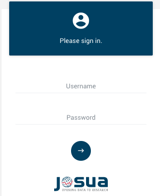  
Fig. 1: Josua-Web login  

## Josua-Web Dashboard  

After successful login, the personalized Josua dashboard appears. Its main menu features several tabs on the upper left corner: Home, Projects, Submission, and Transfers, each of which will be explained in more detail below, with Home as the initially selected default tab.  You can change your password or log out by clicking on the top right corner.

In the upper right corner, the small torso allows you to change your password or log out. When logging in for the first time, the initial password must be replaced by a new password of your choice. To log out of Josua-Web, this can also be achieved by clicking on the torso icon and selecting "Logout".

## Josua-Web Dashboard-Home  

The Home tab, as depicted in Figure 2, offers a roster of your most recent Josua-Jobs, their current status, and indicates whether they executed successfully. Under LATEST JOBS in the middle there is a list of the 20 most recently started jobs of the projects of the logged-in user. On the right upper side, under System state, system statistics are listed that show the utilization and usage intensity of the server regarding all Josua users and jobs.

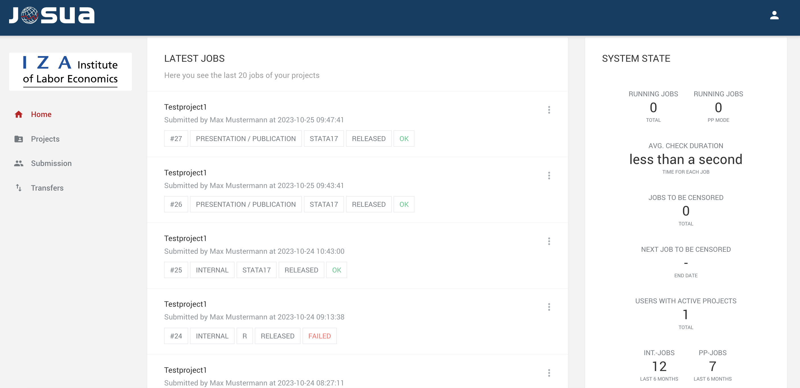
Fig. 2: Josua-Web Dashboard-Home 

Under LATEST JOBS you will find one of the status details below, indicating the current state of your job in the workflow:

* A sequential job number (to identify the job). 
* The categorization of the job as Internal Mode (IM) or Publication Moder (PM).
* The software package used to process the job (SPSS, Stata, R, Python).
* The current status of your job within the workflow, with the following characteristics: 

  - „running“: The job is presently in the process of execution.

  - „censoring“: The job is in censoring (PM) / Creation of png-files (IM) 

  - „released“: The job has been discharged (PM/IM)

Finally a status message (QUEUE, RUNNING as well as OK or FAILED) for the job.
In the final field of the list, you may encounter the following supplementary status details.
   - „success“: The job has run successfully.
   - „failed“: The job has been interrupted. In R, the status failed appears, although the job has run through successfully (due a technical problem). 
   - „aborted“: The job was stopped before completion by the users themselves.

## Josua-Web Jobs

The LATEST JOBS Jobs section gives an overview of the last jobs. Simply click on the three vertical dots on the right to display details about a selected job. In addition to general job information, the job details section provides a comprehensive overview of all submitted input files under "Input" and the corresponding output files under "Output".

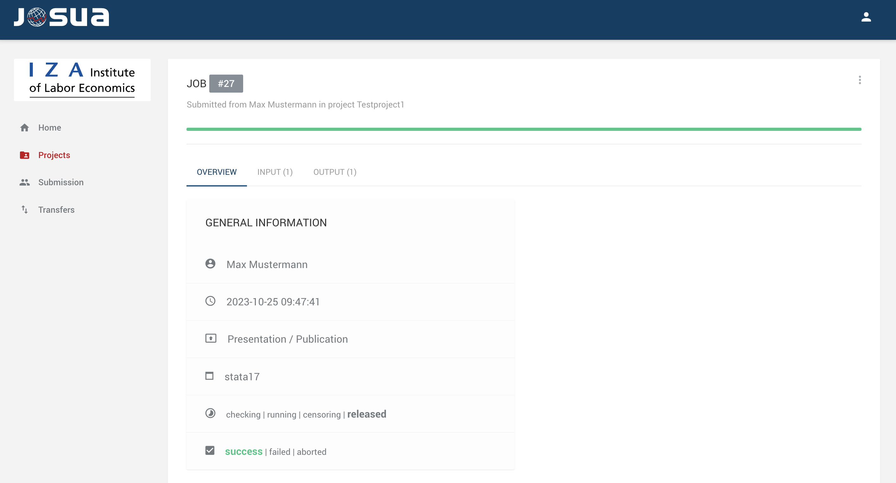
Fig. 3: Details of the selected job

It's important to be aware that Josua operators may restrict the total number of result files per job. Also, keep in mind that log files can be subject to automatic truncation if they reach a specific file size. That depends on the predefined settings of the respective Josua provider.

Within the job view, you can choose from three menu items, with their contents varying in part based on whether the job was submitted in Internal Mode (IM) or Presentation ode (PM).

## Josua-Web Jobs: Internal Mode. 

IM should be used for data editing, preparation of on-site visits, and testing program code. The use of IM has two main functions. On the one hand, it serves as a preliminary check of the analysis results and on the other hand, the use of IM ensures that the code also runs error-free in Josua. There is no limit to the use of IM. This means that an unlimited number of jobs can be submitted in any given period of time.

In IM, uploaded code runs automatically, and the results are displayed with a watermark. These results are for "internal" use only, meaning they are solely used to develop your programs. The visible results can be automatically anonymized by the Josua provider from a data protection point of view. Such measures can be defined individually by the Josua provider and include, for example, cell occupancy in output tables (e.g. <=3) or the suppression of certain commands. Please note that the results are only accessible as long as no new job in PM is oploaded. The results will be made available depending on the server load, the computing strain and the required reviewing effort of the Josua provider. 

These preliminary results of IM may not be viewed, copied or used by third parties. To ensure data privacy in IM, some commands may be blocked by the Josua provider. (pls check [Special Features of Selected Commands](#SpecialFeatures)).

 ## Josua-Web Jobs: Presentation/Publication Mode  

Once the program code has been successfully tested in IM and the preliminary results have been reviewed, the program code can be executed again in PM. PM primarily serves the purpose of producing downloadable output files for digital processing elsewhere. Therefore, the results from PM are subject to examination, both automatically through Josua and manually by the Josua provider, before they are made available. Usually, the duration of the review period is determined by the Josua provider. You will receive a notification email once the output is ready for download. While the results are under review, no additional jobs can be submitted in PM. 

## Josua-Web Projects 
Clicking on "Projects" in the personalized Josua dashboard leads to a list of all research projects to which registered researchers are assigned.   

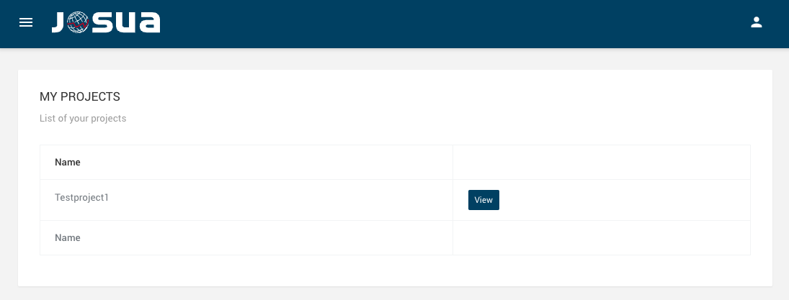
Fig. 4: Projects overview

After clicking the blue "View" button, the project view of the respective project opens. Here, a brief project description is displayed, along with a list of all team members who have access to the project.

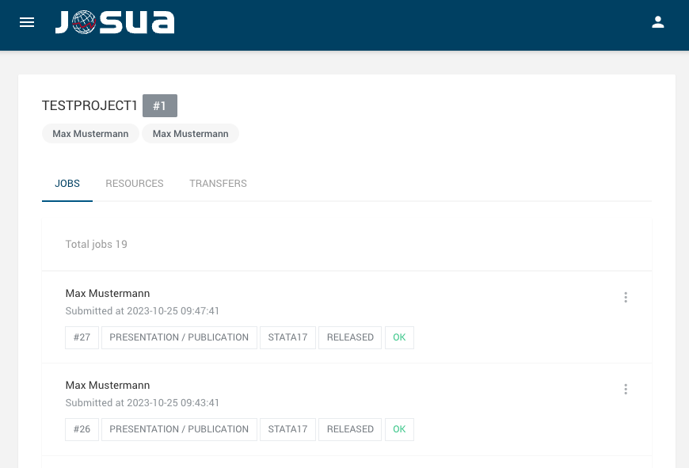
Fig. 5: Projects details

Below the research team members, three menu items can be selected. By default, the "JOBS" view is open, where a complete list of all jobs, meaning all uploaded jobs from all users, are listed within the selected project. You may also overview the complete status details of your jobs, indicating the current state of all your jobs in the workflow. The three vertical dots on the right will guide to the same options available in "Home".

## Resources 
In the second menu item, labeled RESOURCES, you can upload various files. These resources include frequently accessed analysis codes within the project and external datasets that can be merged with on-site data. Files in RESOURCES are automatically available for each job without the need for them to be sent again. If you’re using Stata, you can also upload ado-files at this point. 

To add new files, simply click the ‘+’ button and either drag and drop the desired file into the window or browse and select the file from your hard disk. Keep in mind that only single files can be uploaded. If a file with the same name already exists, it will be overwritten (especially important when dealing with changing versions of ado-files). Note that only pure text files can be uploaded via RESOURCES; other formats (such as .mlib, .plugin or compiled files) are not supported.

After a successful upload, the ado-file will appear in the list with a status of ‘new’. The Josua provider has the ability to review these resources and approve files for further use within Josua. Once a file is approved, it will be displayed as ACCEPTED in green and it becomes permanently available for use within the project in Josua. All uploaded files from each user will be accessible to all authorized project members. If an ado-file cannot be released, its status will be DROPPED in red. If other project members have already uploaded ado-files, you can find them here, too. To make ado-files uploaded via RESOURCES available for on-site use, they must be downloaded once during your visit.

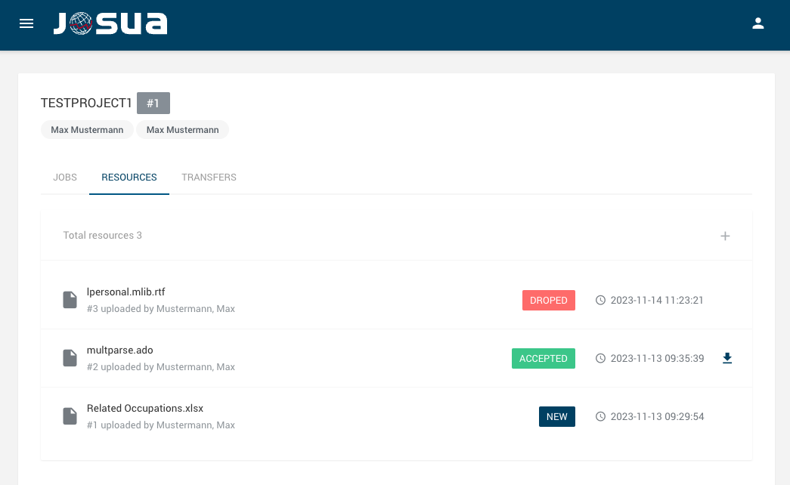
Fig. 6: Resources details

## Transfers
The third menu item TRANSFERS, is primarily used for preparing a guest researcher's stay at the premises of the Josua provider. Users may upload files which were prepared at home for an on-site visit through the tab Transfers. Also if program files generated during on-site visit for further development at home or remote data access can be transferred using the Transfer tab.  To submit files prepared in advance for an on-site visit, use the TRANSFERS tab. In contrast to resources, any file format can be uploaded in transfers. If the files generated during your on-site visit are required for further development off-site or for remote data access, please use the same TRANSFERS feature for upload. Simply drag and drop the desired files into the window on the right, or click within the window to select files from your hard disk. Alternatively, navigate to the Projects tab -> View -> TRANSFERS -> and click on the "+" icon.

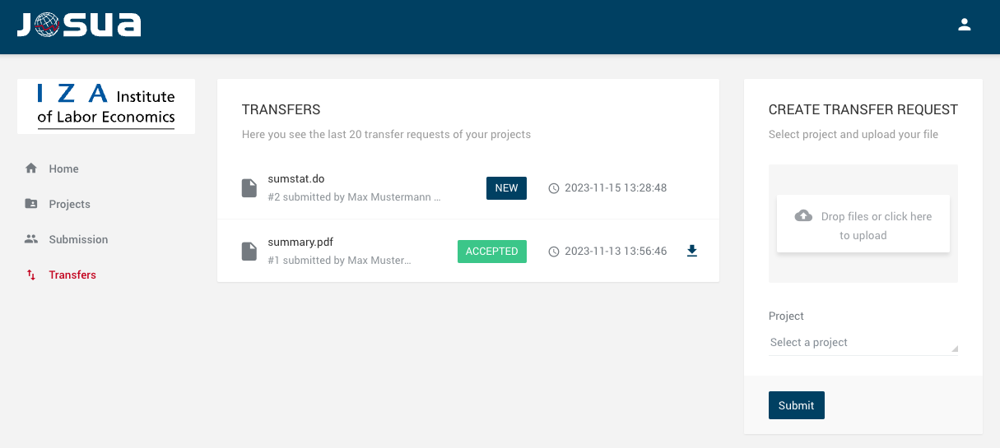
Fig. 7: Transfers tab

Josua currently  accepts the upload of single files only through the drag & drop feature otherwise an error message is displayed; however, you have the option to upload multiple files collectively in one archive file (.zip, .7z). Be aware that when uploading an archive file from a Mac, system files and metadata are automatically generated and integrated in the archive. You must delete these before uploading the archive file to Josua. 

Once uploaded, the file will appear in the list with the status "new." Following a data protection check and approval from the Josua provider, the status changes to "accepted," and the files become available for download. 

To view all uploaded do-files, visit the TRANSFERS tab on the upper left corner. Additionally, you can download all approved files released by the Josua provider by clicking on the file name or the arrow icon on the right.

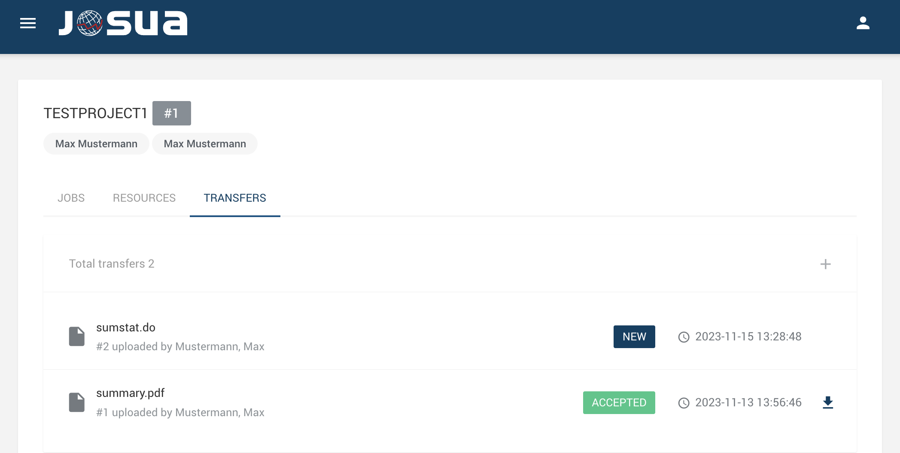
Fig. 8: Transfers details

## Job Submission

To submit jobs, you can upload do-files to the Submission tab. To select the project in the first drop-down menu **(1.)** choose the desired project. If users have multiple active research projects, from the respective project list can be selected in which project a job should be processed. In the second drop-down menu **(2.)**, you can select whether your job will run in IM or PM. 

IM serves the technical evaluation of the analysis code and provides a preview of results. Outputs from IM cannot be downloaded and must not be shared with third parties. Jobs from PM undergo additional data protection review by the Josua provider, can be downloaded, and may be used for further work in the research project.

Lastly, in the third drop-down menu, you can choose the software package that should be used **(3.)** and add finally a comment or description to your job in the comment field **(4.)**. Please refrain from using special characters in the comment field, and ensure your comment is limited to 1,000 characters. Each job you wish to submit must include a file named master.do (or master.r in R). **(5.)**. Remember to upload all the do-files that need to be executed for each job. You can upload a maximum of ten files. If any of these settings are missing, the job cannot be processed with Josua.

The files you've uploaded are displayed above the 'Browse' button. You can review the list and remove individual files as needed. Once you've completed uploading your do-files, click 'Submit' **(6.)** to send your job. After confirmation with "OK," the Home page will automatically be displayed again. There, the new job with a status message (QUEUE, RUNNING, OK, or FAILED) will now be shown in the overview. Once a triggered job has completed processing and has been released, users will receive an automatically generated email informing them that the job has been processed.

Please be aware that if you've uploaded a job in PM, you cannot upload any other jobs in PM until the previous job is released. In IM, it is theoretically possible to run multiple jobs concurrently. Additionally, during the execution of a job in PM, you can start additional jobs in IM. However, we recommend utilizing these options only in exceptional cases, such as when a job runs in PM for an extended period. Therefore, it is recommended to upload a new job only after the previous job has been  completed.

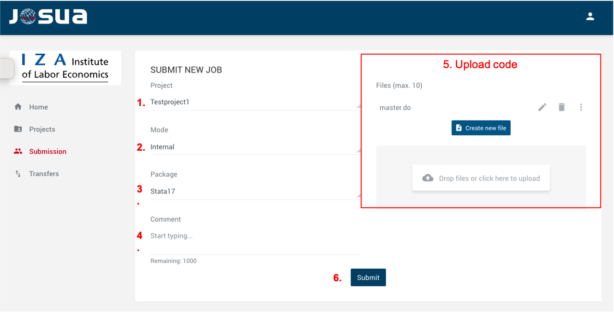
Fig. 9: Job submission tab

## Cancelling Jobs

 Your jobs are displayed in the Home tab. On the right side of each job, there is a multifunction button represented by three vertical dots, which opens the context menu for that job. Within this context menu, there is another similar button located in the upper right corner, allowing you to initiate a 'Stop Job' action. Simply click this button, confirm the safety prompt, and the job will be terminated immediately. Subsequently, the job status will be updated to 'aborted'.

In PM, all generated outputs until termination are saved and can be viewed (if released). The Josua provider then deletes these jobs manually. This means that no further jobs can be uploaded in PM until they are finally deleted. However, if the job was submitted  in IM, the processed results up to termination cannot be viewed.

Users have the option to abort a job anytime. To do so, users should first navigate to the 'Projects' main menu in the dashboard. Subsequently, by clicking the 'View' button, they can access the project associated with the job. An overview of all jobs submitted within a project will appear. The job to be aborted can be selected here. Clicking on the job opens a new page providing detailed information about it. By right-clicking on the three vertical dots, users can choose to abort the job.

When the job is in running mode, the 'Stop job' option changes from gray to black and can be selected. In this case, Josua requests confirmation to terminate the job. 

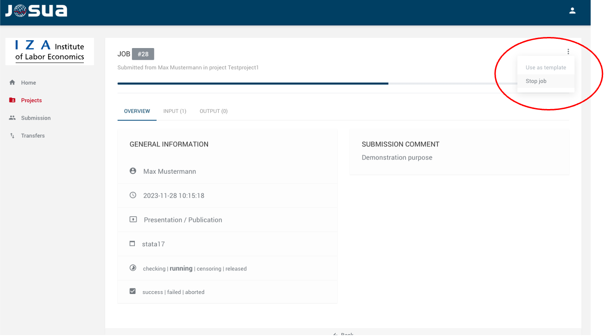
Fig. 10: Cancelling jobs

## Job Termination

If your job terminates with the status 'failed', conduct a self-check on the following aspects:
* If a job terminates in PM, please wait until the Josua provider sends you the error message, which you can use to identify the problem.
* Ensure that your programs adhere to the path specifications.
* Thoroughly review your programs for any programming errors.
* All required files and resources have been released and uploaded.
* All file names are known and correctly spelled. 
* No restricted commands have been used.
* The error message does not provide a helpful clue to the problem.

## Job Results

In the Home view or Projects view, clicking on the three dots next to a displayed item opens the Job view. In the Job view, three menu items can be selected, the contents of which partly differ depending on whether the job was submitted in IM or PM.

The first menu item provides an overview of the information about the submitted job. In this view, comments possibly noted by the user during job submission are displayed. Additionally, the Josua provider has the option, to add comments with important information, during the privacy check of jobs in PM.

In the menu tab under INPUT, all programs uploaded for analysis can be selected and downloaded again.

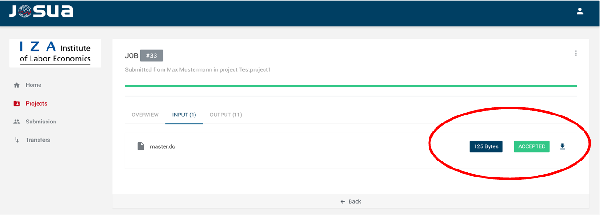
Fig. 11: Input download

The output of each respective job can be extracted from the menu tab under OUTPUT. This view varies depending on whether  IM or PM was applied. If IM was used, the corresponding output is divided into smaller sections (in figure 12 below) and presented in a thumbnail preview with a data protection watermark.

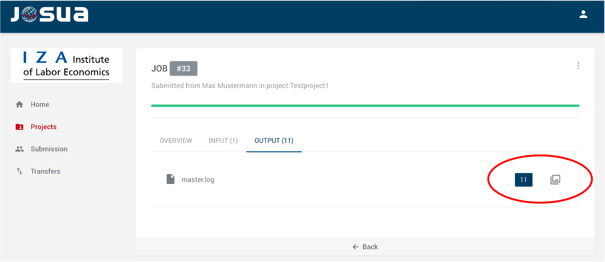
Fig. 12: Output sections

The smaller sections of the output are displayed in a thumbnail preview window. At the bottom, there is a navigation bar that allows switching between different thumbnails of the IM output.

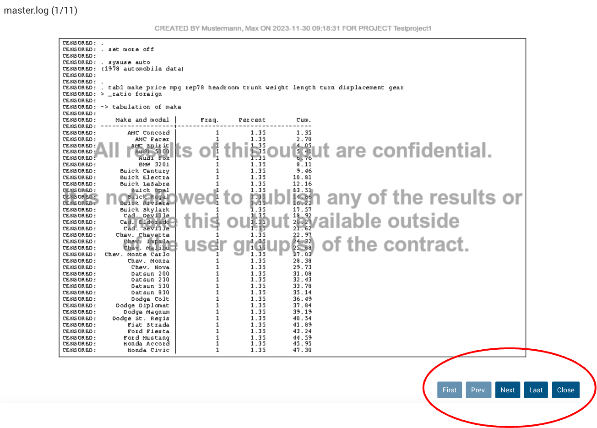
Fig. 13: Thumbnail preview

In addition to these three menu items, the Job view offers, finally the option to duplicate the input of a job and use it as a template for a new job. This feature is highly recommended, especially after successfully completing a job in IM and then requesting it in PM.

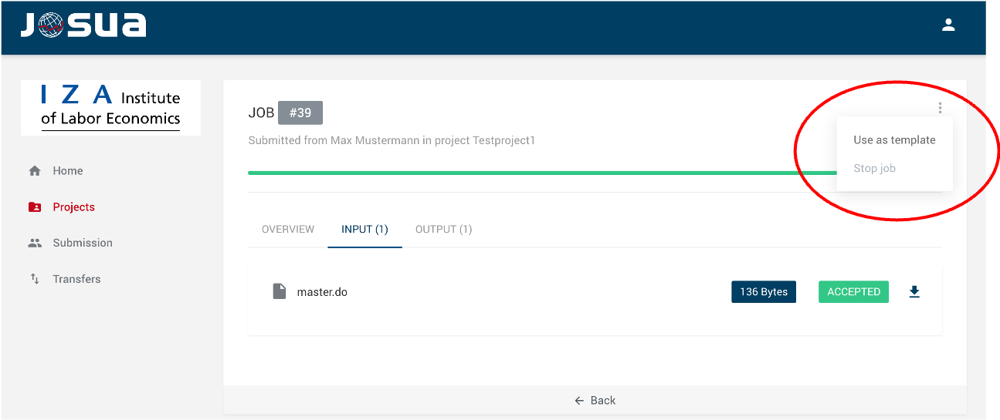
Fig. 14: Analysis template

## Josua Fundamentals

The following section deals with the foundations for using individual project directories, additional resources for utilizing Josua, and setting up a test environment to be able to use Josua during the on-site visit at a Josua provider.

All researchers assigned to a project in Josua have access to the same datasets, including any custom working datasets they have created. Additionally, within a project, users can view the results of all uploaded analysis codes. Users can also be simultaneously assigned to multiple projects within the system. 

## Josua Directories

Every research project is allocated a dedicated directory corresponding to the data requested. Distinct data projects directories remain exclusive and cannot be amalgamated. Hence, users cannot transfer data between project directories, as part of data protection measures.

Each project directory encompasses the following subdirectories, and no additional directories or subdirectories may be created.

| Directory | Description                                                                                                                                                                           |
|-----------|------------------------------------------------------------------------------------------------------------------------------------------------------------------------------------------------------------|
| jdata    | All the requested   original data is available in this directory. Additionally, this folder may include external (aggregated) data. You have read-only permissions for this write-protected directory. |
| jtmp     | All user-generated data sets are stored here (storage space restrictions may be imposed by the Josua provider).                                                                                        |
| jrcs     | This folder contains  all program files as well as supplementary files (e.g. ado-files) for the on-site use.                                                                                          |
| jlog     | This folder has all the result files and graphs.                                                                                                                                                         |
| jsrc     | Contains   all program files that are uploaded automatically during the submission process (eg. master.do, second_file.do etc.), and serves as the default working directory in Josua.     

### Stata-Directory Calls
The subdirectories are accessed in Stata with $jdata, $jrsc, etc, prefixed with a dollar sign. For example, to open the dataset "dataset.dta" in the folder "jdata", in Stata you would use the following command:

``use "$data/dataset.dta", clear`` 

### R Directory Calls
The directory structure mentioned above also applies to the programming language R. However, the way to access subdirectories in R is different from the rules for Stata. In R, subdirectories must be referenced without a leading $. Subdirectories are addressed directly by the name of the subdirectory, as the following example illustrates:

``data <- read.csv("jdata/your_dataset.csv")``
           

## Stata ado-Files 

Stata-ado-files cannot be downloaded from the internet at the premises of a Josua provider. Instead, the Josua provider may offer specific packages through an on-site repository within its network and update the available list of commands regularly. Such offline repositories are accessible both on-site (Josua-Direct) and online through Josua-Web. 

To install Stata-ado-files available at the premises of a Josua provider, please use the following command, which copies the corresponding files to your '$jrcs' directory:

``net install packagename``

Use this command only once, as it singularly copies all pertinent data into the '$jrcs ' folder of the designated project. It should only be used once per project directory. Subsequently, the packages are accessible in the '$jrcs ' folder and are automatically recognized by Stata. All Stata-ado-files in the '$jrcs ' folder can be utilized when executing jobs with Josua without further ado.

The on-site repository undergoes regular updates, but the files copied into the 'prog' folder via the 'net install' command are not updated automatically. To copy a newer version of an ado-file into the '$jrcs' folder, use the following command:

``adoupdate``

If you wish to use other or your own ado-files, which cannot be uploaded (compiled files or non-ASCII files) send them to the Josua provider. These ado-files are also stored in the '$jrcs' folder.

* Temporary Usage: Upload the ado-file along with the do-files. The ado-file will be available only for this job.

* Permanent Usage: Upload the ado-file for the entire project. To do this, open the upload window under the Resources tab using the + symbol on the right. The uploaded files must then be approved by the JoSuA provider.

For exclusive utilization of ado-files in either remote data processing or on-site operations, please upload your files to Josua. Ado-files should be uploaded initially in the 'Projects/Transfers' section under Resources and can then be accessed for subsequent remote data processing or on-site operations: ado-files uploaded here can be downloaded and thus used during your on-site visit.

Some Josua providers make the packages of the Statistical Software Components (SSC) Archive (hosted at the Boston College Department of Economics (BOCODE) and provided by RePEc available within their network as regularly updated local mirrors. The Josua providers may make more detailed information on the use of the ado-files available in this case. If certain packages are still not available, they must be sent (back) to the Josua providers and may be subject to data protection control until the packages are released.

.mo files can be generated via Josua (independent of the mode) in your project directory as follows: 

* Create/modify the do-file that creates the .mo file; please note: 
  - saving the created object with a command like this: 
``mata mosave xyz(), replace dir($localprog/x) ``
  - Here, xyz stands for the name of the created object. The letter after "$localprog/" stands for a possible subfolder in the prog folder in your project directory where the ado-file expects the .mo file (e.g. ``$localprog/x for a file xyz.mo``). 
  - Create the necessary subfolder in your prog folder before saving the .mo file with this command: ``capture mkdir $localprog/x``

* Execute the relevant do-file, e.g. by starting it in a master.do via JoSuA.

## R-Packages

Josua comes standard with R packages from The Comprehensive R Archive Network (CRAN), which are regularly updated through local mirrors in the Josua provider network. These packages can be installed using the 'quiet = TRUE' option. 

``install.packages("packagename", quiet=TRUE)``

In cases where R packages are not accessible on CRAN but are available on platforms like GitHub or R Forge, users are encouraged to provide the corresponding links or packages to the Josua provider. After securty check the Josua provider is supposed to make them avalable it his local network.

## Merge External Data

Your data can include external variables at an aggregate level (such as unemployment rates by districts) if they adhere to the Josua provider data protection guidelines. After inspection and approval by the Josua provider, the external data sets will be made available in the $jdata folder. It is generally not allowed to submit (aggregated) data within program files.

## Setting up a Test Environment at own Worklace

For program development and testing, we recommend setting up a test environment on your own devices to best prepare for working via remote data access or on-site. In the following section, you will learn how to set up such a test environment outside the infrastructure of Josua providers that corresponds to their project directory and servers. It should be noted that Josua providers may have their own specifications that deviate from this, over which we have no influence.

In Josua, you can define the directories created for this purpose (jdata, jtmp, jrcs, jlog etc.) using global macros so that they can be addressed without having to enter the file path every time or even know it. This allows access to directories on the Josua server without having to adjust file paths in the program code, as illustrated in the example below. Please replace "D:\josua" with the path to the folder you have created.

| **Windows**                    | **Other**              |
|--------------------------------|------------------------|
| ``global jdata "C:\josua\jdata\"`` | ``global jdata "./jdata"`` |

It is possible to have automatically execute these commands when Josua opens. To do this in Stata, you need to create a do-file named "profile.do" that contains the appropriate commands. We recommend using such a do-file to set global macros in your test environment. Stata searches for profile.do in various locations when the program starts. Where you store your profile.do with the global macro definitions is up to you. The Stata manual recommends storing profile.do in "./Documents/Stata". It is not allowed to upload the file profile.do to Josua.

Once the macros have been created, the directories can be accessed with $jrsc, etc. For example, opening the dataset "test.dta" in the jdata folder would work as follows:

``use "$jdata/test.dta", clear``

To test merging and analysing external aggregate data in your test environment at home, please save the external data in the jdata folder.

In R, you can define also global variables to set file paths. One way to do this is to use the <<- assignment operator to set the variable on the global scope. Here is a simple example:

``* Define a global variable named jdata in R``  
``jdata <<- "/path to data"``

``* Read the data file in R``  
``data <- read.csv(file.path(jdata, "data.csv"))``

This example code defines a global variable named ``jdata`` and sets it to the path of a data directory. The data file is then read using the ``read.csv()`` function. The following small example reads the file dataset.dta in Stata format (installation of haven package is required). There are also special packages like **dotenv** or **config** in R (available from CRAN) that can be used to make it easier to handle configuration variables and file paths, especially in larger projects.

``* requires 'Haven' package``  
``dat <- read_dta(file.path(jdata,"dataset.dta")) ``

## On-Site Visits

Josua supports guest researchers in various ways. First, analysis code that has already successfully run in a job can be downloaded in Josua. Second, the transfer function can be used to make files available during a guest research stay.

A transfer can be initiated either through the "TRANSFERS" menu within the respective project or through the menu on the left side of the Josua user interface. In the Transfers view, all transfer files from all projects in which the logged-in user is involved are displayed. Transfer files are reviewed by the Josua provider and released for further use with Josua (marked as green "ACCEPTED").

On the right side of the Transfers view, transfer files can be uploaded. To do this, a project must be selected to which the transfer should be assigned. Files uploaded via Transfers and approved are available to all team members of the respective project.

## Designing the Program Files

Primarily, Josua executes program files named master.do or master.r. Additional program files can be uploaded and executed through appropriate commands within these master files. It is necessary to always upload a file named ``master.*`` in order to submit the job. This file is automatically executed after the job has been submitted. Josua automatically opens a master.log file, so another master.log or output file should not be opened in the code.

At the beginning of the master.do file, some general information is provided, and general settings for the following analyses are defined.

``**Parameters for the Do-File ``  
``**Author: Maxi Mustermann ``  
``**Projekt: Testproject``  
``**Date: 04.05.2024``  
``**Filename: master.do``  
``clear``  
``set more off // Necessary for the program to run continuously``  
``set linesize 120 // Max. line length in Internal Mode``  
``*set linesize 255 // Max. line length in Presentation Mode``  

We recommend to set the line length to 120 using the command "set linesize" in IM, as this corresponds to the width of the output window in Josua.

**Important:** Do not use the command ``capture log close`` at this point in the master.do file. Otherwise, any errors occurring before the first "log open" command will not be displayed. Use this command only directly before opening a new log file!

Please be aware that program files should not include any data. Therefore, avoid copying results, institutional or personal IDs into your program files. External data should be submitted to the Josua provider.

For data protection reasons, not all file formats are permitted for uploading or saving results with Josua. The following file formats may be used:

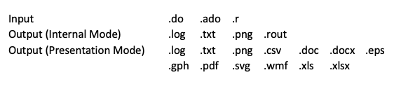
Fig. 15: Input-Output formats

Stata result files' format must be either ".log" or ".txt". You can generate a maximum of 20 output files, each of which must not exceed 2 MB in size. These are the default settings of Josua, which can be adjusted by the respective Josua provider. Stata graphs (.gph) can only be transmitted if they are generated with the "asis" option.  Graphs should be saved on the folder *jlog*. If a file is saved in one of the output formats allowed only in Presentation Mode while in Internal Mode, it may be interpreted as a text file in JoSuA and therefore displayed incorrectly. This issue does not affect the output in Presentation Mode.

## Special Features of Selected Commands

For data protection and security reasons, some Stata commands are not available in Josua or are only partially usable. The following commands are listed below:

#delimit  
The #delimit command must not be used, as it is necessary for the automatic data protection check that the line break marks the end of the command. If line breaks are to be used within commands, these breaks must be created using ///.

#cd  
In the Josua environment, only the predefined directories (jdata, jtmp, jrsc, jlog,) can be used. Therefore, it is not possible to change directories using the cd command.

#exit  
The exit command terminates the program and therefore cannot be used in the Josua environment.

#global  
In the Josua environment, global macros cannot be redefined or created.

#graph save  
The ``graph save`` command for saving .gph files must only be used with the ``asis`` option. If multiple graphs need to be combined, this should be done without saving the graphs separately by naming the graphs within a job using the ``name()`` option and combining them accordingly. Basically, it is the Josua provider who decides which graphic formats are allowed. Generally, Josua allows the formats wmf, eps, and png to be displayed. However, only the png format can be processed in IM. Save the graphs in the folder jlog. 

#list  
The list command is blocked for data protection reasons.

#log  
The log command must include the txt option. Outputting log files in smcl format is not allowed. Furthermore, log files can only be saved in the jlog directory.

#nostop  
Please avoid commands like `nostop` in your program code that avoid program aborts.  

#save  
The save command can only output files in the output formats listed in section [Designing the Program Files](#DesigningtheProgramFiles)   and save them in the jlog directory.

#shell  
The shell command interacts directly with the operating system, so it cannot be used in the Josua environment. The same applies to other commands that directly access the operating system, such as ashell.

#use  
The use command can only be used to access original data located in the jdata directory and partial data created and stored under jtmp.

- [IDSC](https://www.iza.org/idsc).

